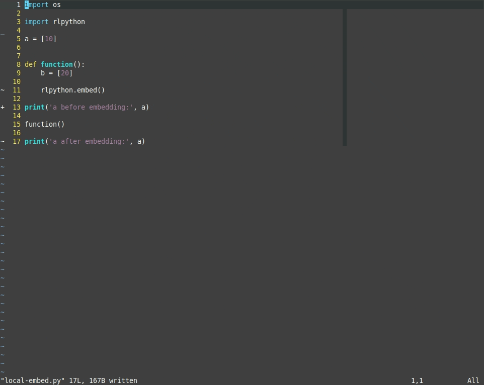
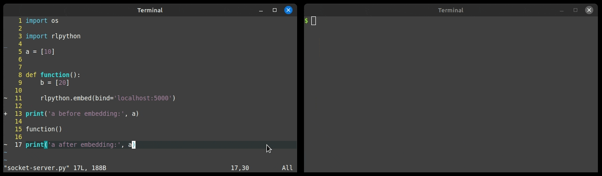
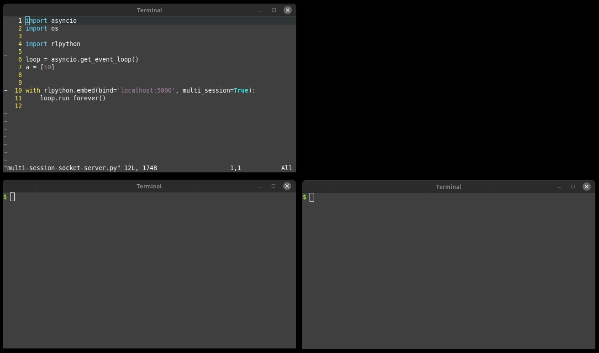

# rlpython


rlpython is a versatile Python REPL (Read-Eval-Print Loop) built on GNU Readline, without any external dependencies.
It serves as a command-line tool, can be seamlessly embedded into scripts, and even operates as a network server, allowing for convenient debugging and monitoring.

- [Installation](#installation)
- [Use-Cases](#use-cases)
  - [Python REPL](#python-repl)
  - [Unix Commands](#unix-commands)
  - [Code Introspection](#code-introspection)
  - [Embedding from Source](#embedding-from-source)
    - [Embedding from Source over Network](#embedding-from-source-over-network)
    - [Embedding from Source over Network for Multiple Users](#embedding-from-source-over-network-for-multiple-users)
- [Custom Commands](#custom-commands)


## Installation

```
$ pip install rlpython
```


## Use-Cases

### Python REPL

rlpython can be used to try or debug any valid Python code.


### Unix Commands

rlpython supports Unix commands prefixed with `!`, for example `!cat foo.txt`.
For convenience rlpython supports aliases and comes with some well-known shell aliases built-in.


### Code Introspection

rlpython has code introspection built-in that can be used to print the signature or documentation of a method or function, or to jump to its implementation using an editor.


### Embedding from Source

rlpython can be embedded in any Python script and be used as a debugger, using `rlpython.embed()`.
The starting rlpython shell then has access to all previous defined variables and imported modules.

```python
import rlpython

rlpython.embed()
```




#### Embedding from Source over Network

rlpython can also bind to a socket and receive commands over the
network. This is useful if your script runs without stdin and stdout.

```python
import rlpython

rlpython.embed(bind='localhost:5000')  # host and port
rlpython.embed(bind='file://socket')   # unix domain socket
```




#### Embedding from Source over Network for Multiple Users

For monitoring, rlpython can be run as a multi-session server, for multiple users.

```python
import asyncio

import rlpython

loop = asyncio.get_event_loop()

with rlpython.embed(bind='localhost:5000', multi_session=True):
    loop.run_forever()
```




## Custom Commands

rlpython has support for Unix-like shell commands, prefixed with `%`. A list of all loaded commands can be seen using `?`.
rlpython has a simple API to define custom commands.

This example defines a command named `user` which prints a list of users with their usernames and full names as a table.
If a username is given as a command line argument, only the full name of the given user is printed.

The command implements tab completion, a help string, and `-l` to limit lines.


```python
import rlpython

from rlpython.utils.argument_parser import ReplArgumentParser
from rlpython.utils.table import write_table

USER = {
    'alice': 'Alice Allison',
    'ally': 'Ally Allison',
    'bob': 'Bob Roberts',
    'carl': 'Carl Carlson',
    'mal': 'Malory Masterson'
}


class UserListCommand:
    """
    Show User list
    """

    NAME = 'user'

    def __init__(self, repl):
        self.repl = repl

    def complete(self, text, state, line_buffer):
        names = sorted(list(USER.keys()))
        candidates = []

        for name in names:
            if name.startswith(text):
                candidates.append(name)

        candidates.append(None)

        return candidates[state]

    def run(self, argv):

        # parse command line arguments
        # ReplArgumentParser is a subclass of argparse.ArgumentParser
        argument_parser = ReplArgumentParser(
            repl=self.repl,
            prog=self.NAME,
        )

        argument_parser.add_argument('username', nargs='?')
        argument_parser.add_argument('-l', '--limit', type=int)

        args = argument_parser.parse_args(argv[1:])

        # show given user
        if args.username:
            if args.username not in USER:
                self.repl.write(
                    f"no user with username '{args.username}' found\n",
                )

                return 1

            # we use repl.write instead of print here, so the command
            # also works over the network
            self.repl.write(f"{USER[args.username]}\n")

        # show all users
        else:
            rows = [['Username', 'Full Name']]

            for index, (user_name, full_name) in enumerate(USER.items()):
                rows.append(
                    [user_name, full_name],
                )

                if args.limit and args.limit == index + 1:
                    break

            write_table(rows, self.repl.write)


rlpython.embed(commands=[UserListCommand])
```

